# PostgreSQL Schema Documentation & Entity-Relationship Model

**Database Version**: PostgreSQL 16  
**Primary Key Convention**: UUIDv7 (RFC 9562 time-ordered)  
**Financial Quantity Format**: `NUMERIC(38,0)` strictly representing integers in smallest atomic units (no floating-point)  
**Timestamps**: `timestamptz` (UTC only)  

---

## 1. Entity-Relationship Overview (ERD)

```mermaid
erDiagram
    %% IDENTITY
    user ||--o{ user_credential : "has passkeys/wallets"
    user ||--o{ session : "maintains"
    user ||--o{ device : "registers"
    user ||--o{ api_key : "provisions"
    user ||--o{ whitelist_address : "whitelists"
    user ||--|| account_security_setting : "configures"

    %% LEDGER
    asset ||--o{ account : "denominates"
    user ||--o{ account : "owns user accounts"
    journal_entry ||--|{ journal_line : "composed of balanced debits/credits"
    account ||--o{ journal_line : "posted to"
    account ||--o{ balance_snapshot : "snapshotted at"
    account ||--o{ hold : "encumbered by"

    %% TRADING & MARKET
    asset ||--o{ market : "base/quote currency"
    market ||--o{ order : "placed on"
    user ||--o{ order : "submits"
    order ||--o{ order_event : "lifecycle log"
    order ||--o{ trade : "fills as maker/taker"
    settlement_batch ||--|{ settlement_item : "batches"
    trade ||--o{ settlement_item : "included in"

    %% CUSTODY
    chain ||--o{ deposit_address : "allocates"
    chain ||--o{ onchain_deposit : "observed on"
    chain ||--o{ onchain_withdrawal : "broadcast to"
    user ||--o{ onchain_deposit : "receives"
    user ||--o{ onchain_withdrawal : "requests"

    %% FIAT
    payment_provider ||--o{ fiat_deposit : "processes"
    payment_provider ||--o{ fiat_withdrawal : "settles"
    user ||--o{ bank_account_link : "links"
    fiat_withdrawal ||--o{ payment_review : "reviewed by"

    %% KYC & COMPLIANCE
    kyc_level ||--o{ kyc_case : "target tier"
    user ||--o{ kyc_case : "initiates"
    kyc_case ||--o{ kyc_document : "contains"
    kyc_case ||--o{ kyc_check_result : "verified by"
    kyc_case ||--o{ kyc_decision : "resolved by"
    user ||--|| risk_profile : "scored in"
    user ||--o{ screening_result : "screened in"

    %% ADMIN & AUDIT
    admin_role ||--o{ admin_user : "assigned to"
    admin_role ||--|{ admin_role_permission : "grants"
    admin_permission ||--|{ admin_role_permission : "mapped to"
    admin_user ||--o{ approval_request : "makes/initiates"
    admin_user ||--o{ approval_step : "checks/signs off"
    approval_request ||--|{ approval_step : "requires dual sign-off"
    audit_event ||--o{ audit_event : "cryptographic prev_hash chain"
```

---

## 2. Domain Schemas & Table Dictionaries

### 2.1 `identity` Schema (Owner: `identity` service)
- **`user`**: Core identity entity. Identified by email and/or EVM wallet address.
- **`user_credential`**: Cryptographic credentials (FIDO2/WebAuthn public keys, SIWE wallets).
- **`device`**: Tracked browser/mobile device fingerprints and trust scores.
- **`session`**: Active user sessions with cryptographically hashed bearer tokens.
- **`api_key`**: Institutional and developer API keys with CIDR IP allowlists and granular permissions.
- **`login_event`**: Append-only audit record of every authentication attempt.
- **`whitelist_address`**: User-defined withdrawal addresses subject to mandatory timelock delay.
- **`account_security_setting`**: Per-user security rules (daily limits, panic freeze state).

### 2.2 `ledger` Schema (Owner: `ledger` service)
- **`asset`**: Supported digital assets and currencies (`BTC`, `ETH`, `USDT`, `ZAR`).
- **`account`**: Chart of accounts separating user available balances, held balances, and system accounts (`system_fee`, `system_insurance`, `system_hot_wallet`).
- **`journal_entry`**: Append-only transaction container for double-entry postings.
- **`journal_line`**: Append-only balanced legs where `sum(debit) == sum(credit)` per entry.
- **`balance_snapshot`**: Periodic checkpoint of account balances at a specific sequence number.
- **`hold`**: Balance holds for open orders or in-flight withdrawals.

### 2.3 `market` & `trading` Schemas (Owner: `trading` service)
- **`market`**: Trading pair parameters (symbol, base asset, quote asset, tick size, lot size, fees, circuit breaker price bands).
- **`candle`**: Aggregated OHLCV candlesticks across multiple timeframes.
- **`fee_schedule`**: Tiered maker/taker fee structures.
- **`order`**: Ingested orders bearing EIP-712 cryptographic user signatures.
- **`order_event`**: Append-only log of order lifecycle state transitions.
- **`trade`**: Matched trade executions emitted by the matching engine.
- **`settlement_batch`**: Aggregated trade batches submitted on-chain to `Settlement.sol`.
- **`settlement_item`**: Merkle leaf bindings between trades and settlement batches.

### 2.4 `custody` Schema (Owner: `chain-watcher` & `settlement` services)
- **`chain`**: Supported settlement blockchains (e.g. Base L2, Arbitrum).
- **`deposit_address`**: Per-user deterministic deposit addresses.
- **`onchain_deposit`**: Ingested on-chain deposits with block confirmation tracking.
- **`onchain_withdrawal`**: Outgoing on-chain withdrawals with risk scores and transaction hashes.
- **`hot_wallet_state`**: Operating balances and reserve thresholds for operational hot wallets.
- **`reserve_snapshot`**: Solvency coverage metrics comparing vault/wallet balances against liabilities.
- **`proof_of_reserves_root`**: Merkle roots published on a schedule for public verification.

### 2.5 `fiat` Schema (Owner: `custody-fiat` service)
- **`payment_provider`**: African and global payment gateways (Stitch, Ozow, M-Pesa).
- **`bank_account_link`**: Masked bank accounts verified for fiat payouts.
- **`fiat_deposit`**: Inbound fiat payment intents and webhooks.
- **`fiat_withdrawal`**: Outbound payouts gated by four-eyes approval above thresholds.
- **`payment_review`**: Compliance review notes on flagged transactions.

### 2.6 `kyc` & `compliance` Schemas (Owner: `kyc` & `compliance` services)
- **`kyc_level`**: Tiers L0 (browse), L1 (basic), L2 (full), L3 (institutional) and limits.
- **`risk_profile`**: Risk scoring, PEP flags, sanctions check statuses.
- **`kyc_case`**: Verification workflows and assigned reviewer states.
- **`kyc_document`**: Secure references to encrypted identification documents.
- **`kyc_check_result`**: Liveness, document OCR, and biometric verification outputs.
- **`kyc_decision`**: Append-only audit of tier approvals and rejections.
- **`screening_result`**: Automated sanctions/PEP/adverse media screening responses.
- **`sanction_hit`**: Confirmed or investigated matches against watchlists.
- **`suspicious_activity_flag`**: MLRO investigation cases and SAR filings.
- **`travel_rule_record`**: FATF Travel Rule IVMS101 compliance payloads.

### 2.7 `admin` & `audit` Schemas (Owner: `admin-api` service)
- **`admin_user`**: Administrative users authenticating solely via hardware WebAuthn keys.
- **`admin_role` & `admin_permission`**: Granular role-based access control.
- **`approval_request` & `approval_step`**: Four-eyes principle engine.
- **`admin_setting_change`**: Dual-authorized changes to system parameters.
- **`audit_event`**: Append-only, SHA-256 hash-chained immutable log of all operations.
- **`audit_anchor`**: Periodic on-chain anchoring of the audit log head hash.

### 2.8 `notify` Schema (Owner: `notifications` service)
- **`notification_template`**: Multi-channel message templates.
- **`notification_dispatch`**: Outbox for asynchronous email, SMS, and webhook delivery.
