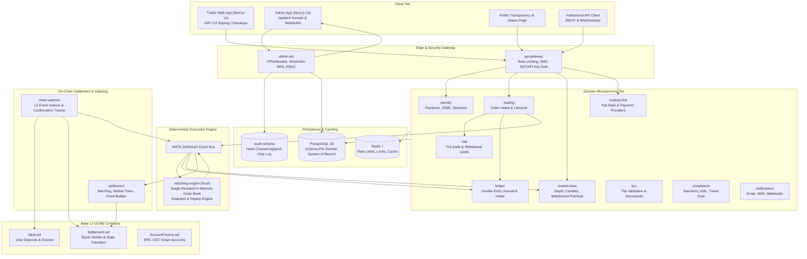
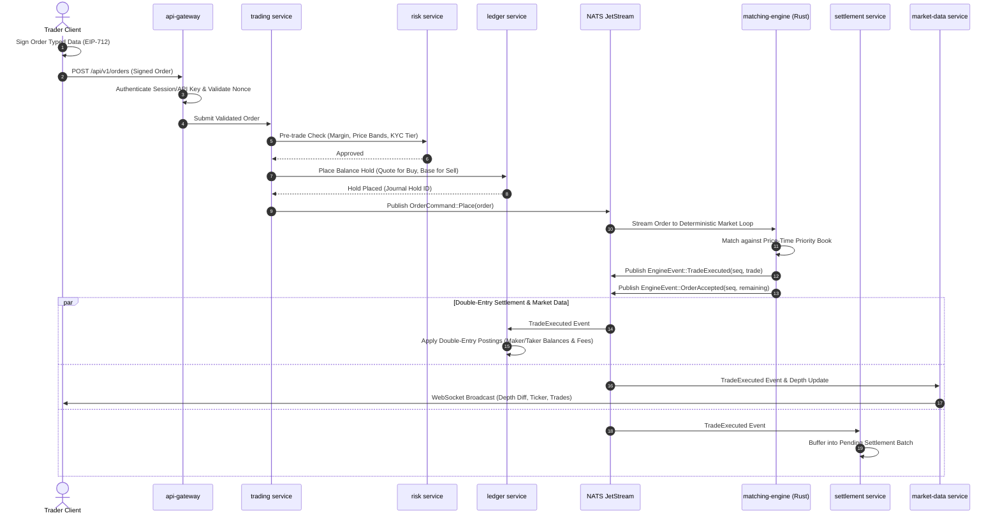
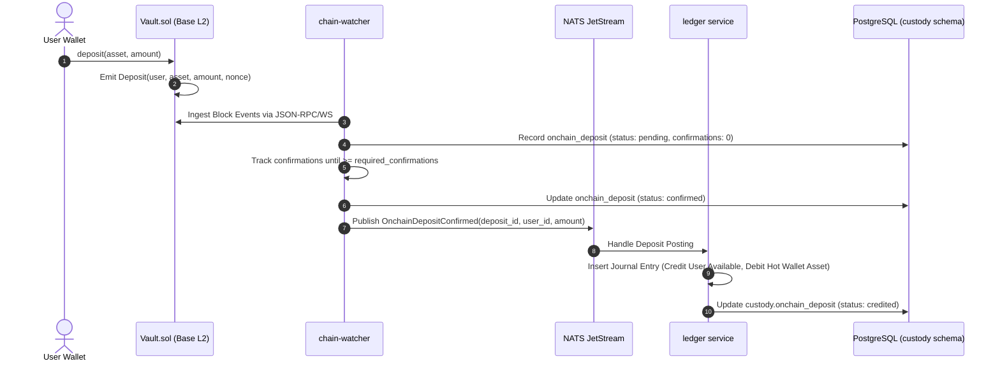
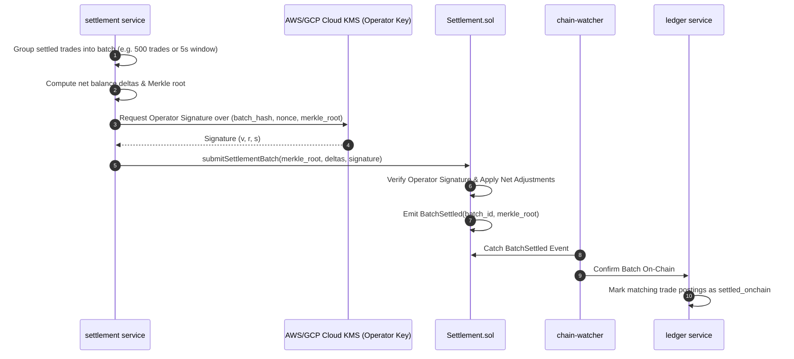
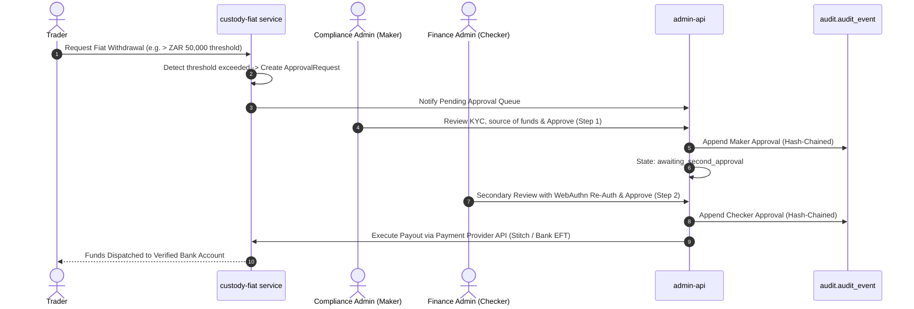
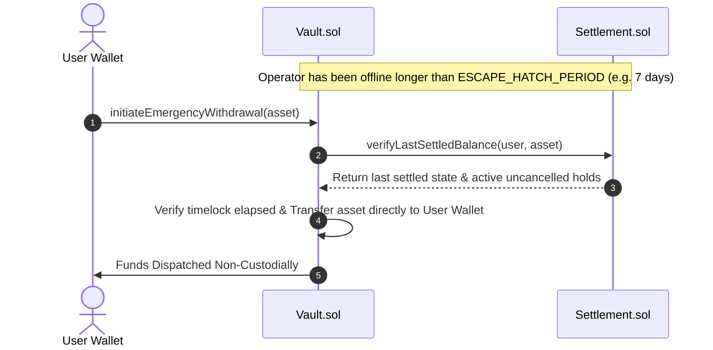

# Hybrid Exchange Platform Architecture Specification

## 1. System Overview & Principles

The Platform is a production-grade **hybrid spot exchange** delivering centralized exchange (CEX) speed with decentralized, non-custodial on-chain asset custody.

### Core Non-Negotiable Invariants
1. **Funds Safety Above Everything**: Users self-custody assets in on-chain vault contracts (`Vault.sol`). The Platform can never move user funds without a cryptographic user signature (EIP-712 order or direct vault instruction).
2. **Deterministic Matching Core**: Off-chain matching engine implemented in Rust operates single-threaded per market, processing orders sequentially with fixed-point integer math (zero floating-point arithmetic) and event sourcing.
3. **Full Auditability & Double-Entry Invariant**: Every monetary balance update is backed by a balanced double-entry journal entry (`sum(debit) == sum(credit)`). Every system and admin action is committed to an append-only, SHA-256 hash-chained audit log anchored periodically on-chain.
4. **Isolated Admin System**: The admin application (`apps/admin`) and backend (`services/admin-api`) run on a separate domain, distinct database credentials, mandatory hardware-key (WebAuthn) MFA, and four-eyes (maker-checker) approval workflows.
5. **Separable Fiat Rails**: Local fiat currency rails (ZAR/NGN/KES/GHS) are completely isolated behind a compliance gateway and enabled on a strict per-jurisdiction licensing basis.

---

## 2. High-Level Component Diagram

---

## 3. Core Data & Execution Flows

### 3.1 Order Lifecycle & Trade Execution Flow

### 3.2 On-Chain Deposit & Crediting Flow

### 3.3 On-Chain Batch Settlement Flow

### 3.4 Fiat Deposit & Maker-Checker (Four-Eyes) Withdrawal Flow

### 3.5 Emergency Escape Hatch Execution Flow

---

## 4. Service Boundaries & Schema Ownership

Every microservice in the platform possesses **exclusive ownership** of its PostgreSQL schema:

| Service | Schema | Key Responsibilities & Owned Tables |
| :--- | :--- | :--- |
| `identity` | `identity` | User accounts, WebAuthn passkeys, SIWE credentials, session management, device tracking. |
| `kyc` | `kyc` | KYC cases, document verification results, tier limits (L0 to L3), risk profiles. |
| `ledger` | `ledger` | Double-entry bookkeeping: assets, user & system accounts, balanced journal lines, holds, snapshots. |
| `trading` | `trading` | Order ingestion, order cancellation, order lifecycle events, fee schedules. |
| `matching-engine` | *In-Memory + Event Log* | Deterministic order matching, sequential event assignment, tick and trade generation. |
| `settlement` | `trading` (settlement tables) | Batch aggregation, Merkle proof generation, on-chain transaction dispatch. |
| `chain-watcher` | `custody` | EVM block indexing, deposit confirmations, withdrawal broadcast confirmation. |
| `custody-fiat` | `fiat` | Payment provider integrations, bank account linkings, fiat deposit/withdrawal lifecycles. |
| `risk` | `risk` | Pre-trade risk assessment, market circuit breakers, withdrawal velocity limits. |
| `compliance` | `compliance` | Sanctions screening, PEP checks, suspicious activity reporting (SAR), Travel Rule records. |
| `admin-api` | `admin` | Admin authentication, granular RBAC, four-eyes approval workflows, configuration changes. |
| *Platform Audit* | `audit` | Append-only, cryptographically hash-chained log of all admin, financial, and security events. |
| `notifications` | `notify` | Dispatching multi-channel notifications (email, SMS, push, webhooks). |

---

## 5. High Availability, Fault Tolerance & Recovery

1. **Matching Engine Failure**:
   - The matching engine writes periodic snapshots (e.g. every 100,000 events) and relies on the NATS JetStream event log.
   - Upon restart, the engine loads the latest valid state snapshot and replays strictly sequenced events from the offset to re-establish exact order book memory state.
2. **Double-Entry Ledger Guarantees**:
   - Constraint triggers in PostgreSQL reject any journal entry where `sum(debit) != sum(credit)`.
   - Financial tables reject `UPDATE` and `DELETE` operations via database triggers; corrections must be recorded via compensating entries.
3. **Network Reorg Protection**:
   - `chain-watcher` requires a configurable number of block confirmations on Base L2 (minimum 12 blocks) before emitting credited deposit events to the ledger.
